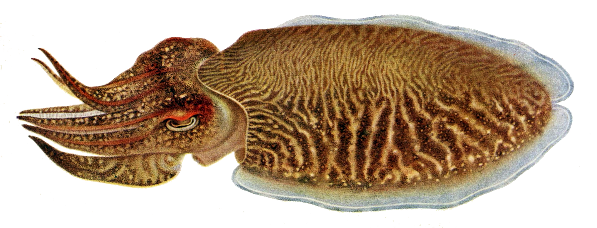

Welcome to Sepia!
*****************
.. automodule:: sepia
    :members:

Sepia is a python implementation of `GPMSA`_.

.. _GPMSA: https://github.com/lanl/gpmsa

.. topic:: Overview

    Sepia implements Bayesian emulation and calibration with the ability to handle multivariate outputs.

    Example jupyter notebooks are found `here`_.

    Full source code on `GitHub`_.

.. _here: https://github.com/lanl/SEPIA/tree/master/sepia/Examples

.. _GitHub: https://github.com/lanl/SEPIA

API
***
.. toctree::
    :maxdepth: 2

    data
    model
    shared_hier_model
    param
    prior
    mcmc
    model_internals
    predict

Indices and tables
==================
* :ref:`genindex`
* :ref:`modindex`
* :ref:`search`
